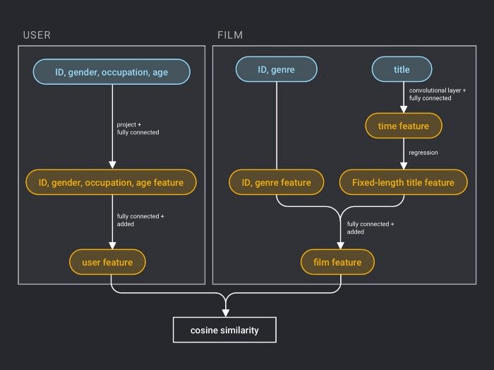

# Recommender System 

<h3>Milvus Docs 需要你的帮助</h3>
本文档暂时没有中文版本，欢迎你成为社区贡献者，协助中文技术文档的翻译。 
你可以通过页面右边的 <b>Edit this page</b> 按钮直接贡献你的翻译。更多详情，参考 <a href="https://github.com/milvus-io/milvus-docs/blob/v2.0.0/CONTRIBUTING.md">贡献指南</a>。如需帮助，你可以 <a href="https://github.com/milvus-io/milvus-docs/issues/new/choose">发起 GitHub Issue</a>。

This tutorial demonstrates how to use Milvus, the open-source vector database, to build a recommendation system.
- [Open Jupyter notebook](https://github.com/milvus-io/bootcamp/blob/master/solutions/recommender_system/recommender_system.ipynb)
- [Quick deploy](https://github.com/milvus-io/bootcamp/blob/master/solutions/recommender_system/quick_deploy)

The ML Model and third-party software used include:
- PaddlePaddle
- Redis or MySQL

 

The recommender system is a subset of the information filtering system, which can be used in various scenarios including personalized movie, music, product, and feed stream recommendation. Unlike search engines, recommender systems do not require users to accurately describe their needs but discover users' needs and interests by analyzing user behaviors.

 

In this tutorial, you will learn how to build a movie recommender system that can suggest movies meeting user interests. To build such a recommender system, first download a movie-related dataset. This tutorial uses MovieLens 1M. Alternatively, you can prepare your own datasets, which should include such information as users' ratings of movies, users' demographic characteristics, and movie description. Use PaddlePaddle to combine user IDs and features and convert them into 256-dimensional vectors. Convert movie IDs and features into vectors in a similar way. Store the movie vectors in Milvus and use user vectors for similarity search. If the user vector is similar to a movie vector, Milvus will return the movie vector and its ID as the recommendation result. Then query movie information using the movie vector ID stored in Redis or MySQL.

 

