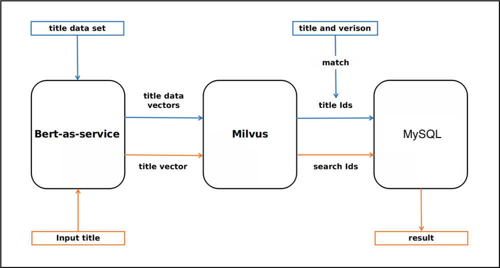

# Text Search Engine

<h3>Milvus Docs 需要你的帮助</h3>
本文档暂时没有中文版本，欢迎你成为社区贡献者，协助中文技术文档的翻译。 
你可以通过页面右边的 <b>编辑</b> 按钮直接贡献你的翻译。更多详情，参考 <a href="https://github.com/milvus-io/milvus-docs/blob/v2.0.0/CONTRIBUTING.md">贡献指南</a>。如需帮助，你可以 <a href="https://github.com/milvus-io/milvus-docs/issues/new/choose">提交 GitHub Issue</a>。

In this tutorial, you will learn how to use Milvus, the open-source vector database, to build a text search engine.
- [Open Jupyter notebook](https://github.com/milvus-io/bootcamp/blob/master/solutions/text_search_engine/text_search_engine.ipynb)
- [Quick deploy](https://github.com/milvus-io/bootcamp/blob/master/solutions/text_search_engine/quick_deploy)
The ML model and third-party software used include:
- BERT
- MySQL

 

One major application of Milvus in the field of natural language processing (NLP) is text search engine. It is a great tool that can help users find the information they are looking for. It can even surface information that is hard to find. Text search engines compare the keywords or semantics users input against a database of texts, and then return the results that meet certain criteria. 

 

In this tutorial, you will learn how to build a text search engine. This tutorial uses BERT to convert texts into fixed-length vectors. Milvus is used as a vector database for storage and vector similarity search. Then use MySQL to map the vector IDs generated by Milvus to the text data.

 

