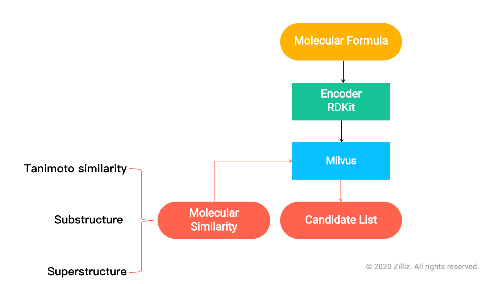
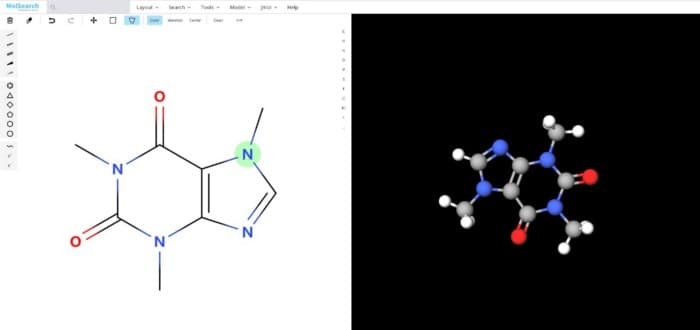

# Molecular Similarity Search 

This tutorial demonstrates how to use Milvus, the open-source vector database, to build a molecular similarity search system.
- [Open Jupyter notebook](https://github.com/milvus-io/bootcamp/blob/master/solutions/molecular_similarity_search/molecular_search.ipynb)
- [Quick deploy](https://github.com/milvus-io/bootcamp/blob/master/solutions/molecular_similarity_search/quick_deploy)
- [Try demo](https://milvus.io/milvus-demos/)
The third-party software used include:
- RDKit
- MySQL

 

Drug discovery is an important part of new medicine research and development. The process of drug discovery includes target selection and confirmation. When fragments or lead compounds are discovered, researchers usually search for similar compounds in internal or commercial compound libraries in order to discover structure-activity relationship (SAR), compound availability. Ultimately, they will evaluate the potential of the lead compounds to be optimized to candidate compounds. In order to discover available compounds from billion-scale compound libraries, chemical fingerprint is usually retrieved for substructure search and molecule similarity search.

 

In this tutorial, you will learn how to build a molecular similarity search system that can retrieve the substructure, superstructure, and similar structure of a particular molecule. RDKit is an open-source cheminformatics software that can convert molecule structures into vectors. Then, the vectors are stored in Milvus and Milvus can perform similarity search on vectors. Milvus also automatically generates a unique ID for each vector. The mapping of vector IDs and structure of molecules are stored in MySQL.

 

