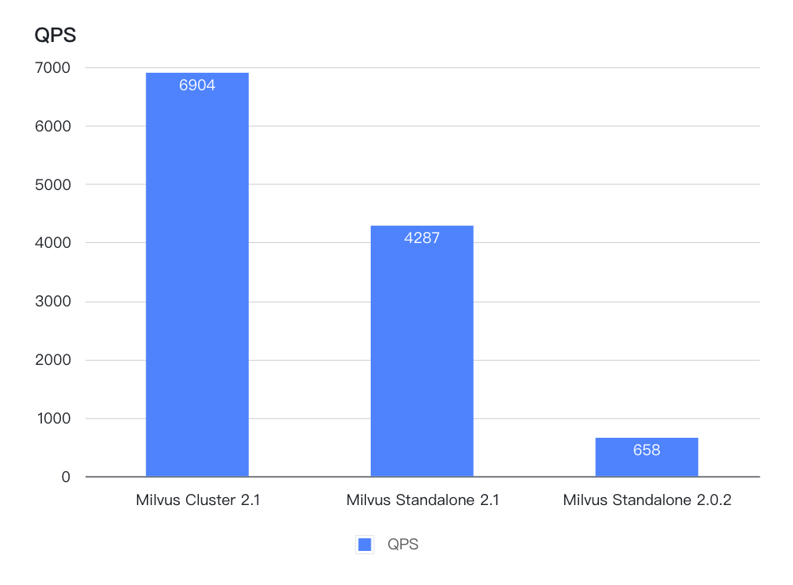
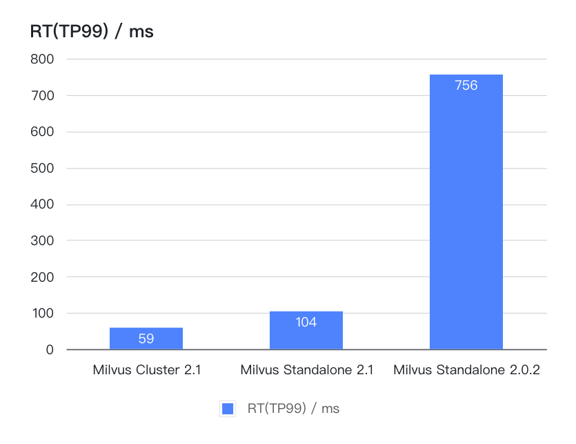

# Milvus 2.1 Benchmark Test Report

This report shows the major test results of Milvus 2.1, covering the performances of data insertion, index building, and vector similarity search. The tests aim to provide a benchmark against which the performances of future Milvus releases can be measured.

## Terminology

<details>
    <summary>Click to see the details of the terms used in the test</summary>
    <table class="terminology">
        <thead>
            <tr>
                <th>Term</th>
                <th>Description</th>
            </tr>
        </thead>
        <tbody>
            <tr>
                <td>nq</td>
                <td>Number of vectors to be searched in one search request</td>
            </tr>
            <tr>
                <td>topk</td>
                <td>Number of the nearest vectors to be retrieved for each vector (in nq) in a search request</td>
            </tr>
            <tr>
                <td>ef</td>
                <td>A search parameter specific to <a href="https://milvus.io/docs/v2.1.2/index.md">HNSW index</a></td>
            </tr>
            <tr>
                <td>RT</td>
                <td>Response time from sending the request to receiving the response</td>
            </tr>
            <tr>
                <td>QPS</td>
                <td>Number of search requests that are successfully processed per second</td>
            </tr>
        </tbody>
    </table>
</details>

## Test environment

All tests are performed under the following environments.

### Hardware environment

| Hardware | Specification                             |
| -------- | ----------------------------------------- |
| CPU      | Intel(R) Xeon(R) Gold 6226R CPU @ 2.90GHz |
| Memory   | 16\*\32 GB RDIMM, 3200 MT/s               |
| SSD      | SATA 6 Gbps                               |

### Software environment

|    Software   |                                Version                                |
| ------------- | --------------------------------------------------------------------- |
|    Milvus     | <li>2.1.0-20220729-dcd6c9e5</li> <br> <li>2.0.2-20220401-898533c5</li>|
| Milvus GO SDK | v2.1.1-0.20220801085923-509bbbbc89eb                                  |

### Deployment scheme

- Milvus instance (standalone or cluster) in each test is deployed via [Helm](https://milvus.io/docs/v2.1.2/install_standalone-helm.md) on a Kubernetes cluster based on physical or virtual machines.
- Configurations of the tested Milvus instances merely vary in the number of CPU cores, the size of memory, and the number of replicas (worker nodes), which only applies to Milvus cluster.
- Unspecified configurations are [default configurations](https://github.com/milvus-io/milvus-helm/blob/master/charts/milvus/values.yaml).
- Milvus dependencies (MinIO, Pulsar, and etcd) store data on the local SSD in each node.
- Search requests are sent to the Milvus instances via [Milvus GO SDK](https://github.com/milvus-io/milvus-sdk-go/tree/master/tests).

### Data sets

The test uses the open source dataset SIFT (128 dimensions) from [ANN-Benchmarks](https://github.com/erikbern/ann-benchmarks/#data-sets).

## Test pipeline

1. Start a Milvus instance by Helm with respective server configurations as listed in each test.
2. Connect to the Milvus instance via Milvus GO SDK and get the corresponding test results.
3. Create a collection.
4. Insert 1 million SIFT vectors. Build an HNSW index and configure the index parameters by setting `M`=8 and `efConstruction`=200.
5. Load the collection.

## Test results

The test conducts a concurrent search on the the prepared data in the created collection and records the search performance metrics. The test result shows:

- When search parameters `nq`=1, `topk`=1, `ef`=64, search concurrency is **400** and the duration of concurrency is **5 hours**. 

The detailed performance test results of Milvus 2.1 cluster, standalone, and Milvus 2.0.2 standalone is shown below.

### Milvus 2.1 cluster

<details>
    <summary><b>Server configurations (cluster)</b></summary>

```yaml
image:
  all:
    tag: 2.1.0-20220729-dcd6c9e5
queryNode:
  replicas: 1
  resources:
    limits:
      cpu: "12.0"
      memory: 8Gi
```

</details>

**Search performance**

| QPS  | RT(TP99) / ms | RT(TP95) / ms | fail/s |
|------|---------------|---------------|--------|
| 6904 | 59            | 58            | 0      |

### Milvus 2.1 standalone

<details>
    <summary><b>Server configurations (standalone)</b></summary>

```yaml
image:
  all:
    tag: 2.1.0-20220729-dcd6c9e5
standalone:
  replicas: 1
  resources:
    limits:
      cpu: "12.0"
      memory: 16Gi
```

</details>

**Search performance**

| QPS  | RT(TP99) / ms | RT(TP95) / ms | fail/s |
|------|---------------|---------------|--------|
| 4287 | 104           | 103           | 0      |


### Milvus 2.0.2 standalone

<details>
    <summary><b>Server configurations (standalone)</b></summary>

```yaml
image:
  all:
    tag: 2.0.2-20220401-898533c5
standalone:
  replicas: 1
  resources:
    limits:
      cpu: "12.0"
      memory: 16Gi
```

</details>

**Search performance**

| QPS | RT(TP99) / ms | RT(TP95) / ms | fail/s |
|-----|---------------|---------------|--------|
| 658 | 756           | 748           | 0      |

## Summary





- In the current test scenario, the QPS of Milvus cluster is better than that of Milvus standalone under  1 million dataset.
- In the current test scenario, the QPS of Milvus 2.1 standalone is better than that of Milvus 2.0.2 standalone under 1 million dataset.

## What's next

- Learn how to [perform a Milvus 2.1 benchmark by yourself](https://milvus.io/blog/2022-08-16-A-Quick-Guide-to-Benchmarking-Milvus-2-1.md).
