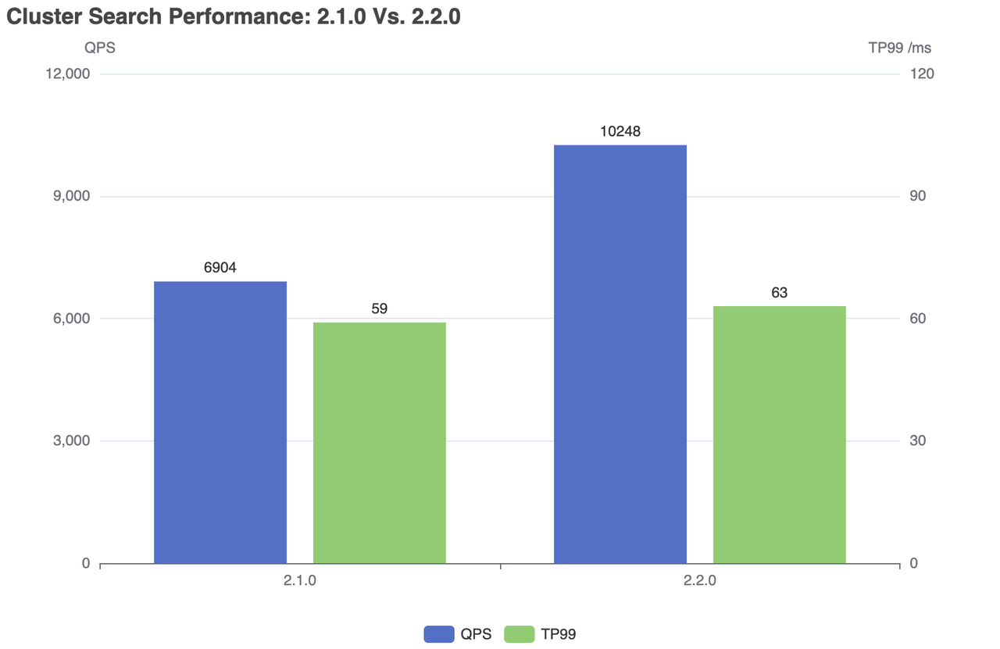
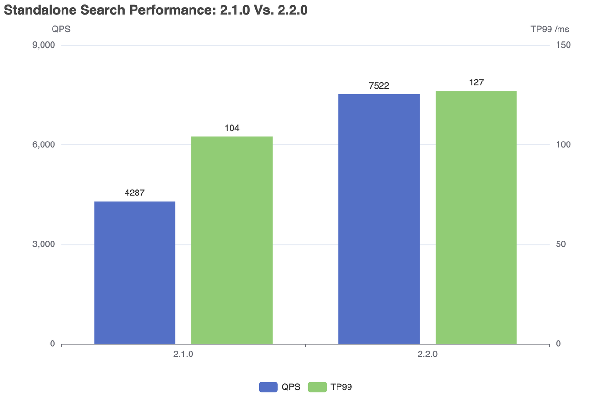
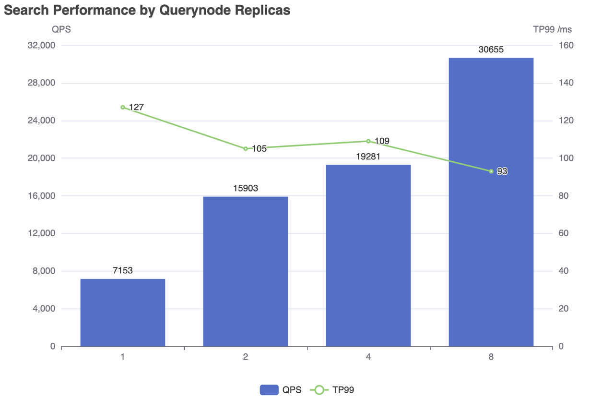

# Milvus 2.2 Benchmark Test Report

This report shows the major test results of Milvus 2.2.0. It aims to provide a picture of Milvus 2.2.0 search performance, especially in the capability to scale up and scale out.

## Summary

- Comparing with Milvus 2.1, the QPS of Milvus 2.2.0 increases over 48% in cluster mode and over 75% in standalone mode.
- Milvus 2.2.0 has an impressive capability to scale up and scale out:
  - QPS increases linearly when expanding CPU cores from 8 to 32.
  - QPS increases linearly when expanding Querynode replicas from 1 to 8.


## Terminology

<details>
    <summary>Click to see the details of the terms used in the test</summary>
    <table class="terminology">
        <thead>
            <tr>
                <th>Term</th>
                <th>Description</th>
            </tr>
        </thead>
        <tbody>
            <tr>
                <td>nq</td>
                <td>Number of vectors to be searched in one search request</td>
            </tr>
            <tr>
                <td>topk</td>
                <td>Number of the nearest vectors to be retrieved for each vector (in nq) in a search request</td>
            </tr>
            <tr>
                <td>ef</td>
                <td>A search parameter specific to <a href="https://milvus.io/docs/v2.2.x/index.md">HNSW index</a></td>
            </tr>
            <tr>
                <td>RT</td>
                <td>Response time from sending the request to receiving the response</td>
            </tr>
            <tr>
                <td>QPS</td>
                <td>Number of search requests that are successfully processed per second</td>
            </tr>
        </tbody>
    </table>
</details>

## Test environment

All tests are performed under the following environments.

### Hardware environment

| Hardware | Specification                             |
| -------- | ----------------------------------------- |
| CPU      | Intel(R) Xeon(R) Gold 6226R CPU @ 2.90GHz |
| Memory   | 16\*\32 GB RDIMM, 3200 MT/s               |
| SSD      | SATA 6 Gbps                               |

### Software environment

|    Software   |                                Version                                |
| ------------- | --------------------------------------------------------------------- |
|    Milvus     | v2.2.0                                                                |
| Milvus GO SDK | v2.2.0                                                                |

### Deployment scheme

- Milvus instances (standalone or cluster) are deployed via [Helm](https://milvus.io/docs/install_standalone-helm.md) on a Kubernetes cluster based on physical or virtual machines.
-  Different tests merely vary in the number of CPU cores, the size of memory, and the number of replicas (worker nodes), which only applies to Milvus clusters.
- Unspecified configurations are identical to [default configurations](https://github.com/milvus-io/milvus-helm/blob/master/charts/milvus/values.yaml).
- Milvus dependencies (MinIO, Pulsar and Etcd) store data on the local SSD in each node.
- Search requests are sent to the Milvus instances via [Milvus GO SDK](https://github.com/milvus-io/milvus-sdk-go/tree/master/tests).

### Data sets

The test uses the open-source dataset SIFT (128 dimensions) from [ANN-Benchmarks](https://github.com/erikbern/ann-benchmarks/#data-sets).

## Test pipeline

1. Start a Milvus instance by Helm with respective server configurations as listed in each test.
2. Connect to the Milvus instance via Milvus GO SDK and get the corresponding test results.
3. Create a collection.
4. Insert 1 million SIFT vectors. Build an HNSW index and configure the index parameters by setting `M` to `8` and `efConstruction` to `200`.
5. Load the collection.
6. Search with different concurrent numbers with search parameters `nq=1, topk=1, ef=64`, the duration of each concurrency is at least 1 hour.

## Test results

### Milvus 2.2.0 v.s. Milvus 2.1.0 

#### Cluster

<details>
    <summary><b>Server configurations (cluster)</b></summary>

```yaml
queryNode:
  replicas: 1
  resources:
    limits:
      cpu: "12.0"
      memory: 8Gi
    requests:
      cpu: "12.0"
      memory: 8Gi
```

</details>

**Search performance**

| Milvus | QPS   | RT(TP99) / ms | RT(TP50) / ms | fail/s |
| ------ |------ |---------------|---------------|--------|
| 2.1.0  | 6904  | 59            | 28            | 0      |
| 2.2.0  | 10248 | 63            | 24            | 0      |



#### Standalone

<details>
    <summary><b>Server configurations (standalone)</b></summary>

```yaml
standalone:
  replicas: 1
  resources:
    limits:
      cpu: "12.0"
      memory: 16Gi
    requests:
      cpu: "12.0"
      memory: 16Gi
```

</details>

**Search performance**

| Milvus | QPS  | RT(TP99) / ms  | RT(TP50) / ms | fail/s |
|------  |------|--------------- |---------------|--------|
| 2.1.0  | 4287 | 104            | 76            | 0      |
| 2.2.0  | 7522 | 127            | 79            | 0      |



### Milvus 2.2.0 Scale-up

Expand the CPU cores in one Querynode to check the capability to scale up.

<details>
    <summary><b>Server configurations (cluster)</b></summary>

 ```yaml   
queryNode:
  replicas: 1
  resources:
    limits:
      cpu: "8.0" /"12.0" /"16.0" /"32.0"
      memory: 8Gi
    requests:
      cpu: "8.0" /"12.0" /"16.0" /"32.0"
      memory: 8Gi
```

</details>

**Search Performance**

| CPU cores | Concurrent Number | QPS  | RT(TP99) / ms | RT(TP50) / ms | fail/s |
| ------|------|------|---------------|---------------|--------|
| 8 | 500 | 7153 | 127            | 83            | 0      |
| 12 | 300 | 10248 | 63            | 24            | 0      |
| 16 | 600 | 14135 | 85            | 42            | 0      |
| 32 | 600 | 20281 | 63            | 28            | 0      |


### Milvus 2.2.0 Scale-out

Expand more replicas with more Querynodes to check the capability to scale out.

<div class="alert note">

Note: the number of Querynodes equals the `replica_number` when loading the collection.

</div>

<details>
    <summary><b>Server configurations (cluster)</b></summary>

```yaml
queryNode:
  replicas: 1 / 2 / 4 / 8      
  resources:
    limits:
      cpu: "8.0"
      memory: 8Gi
    requests:
      cpu: "8.0"
      memory: 8Gi
```

</details>


| Replicas | Concurrent Number | QPS  | RT(TP99) / ms | RT(TP50) / ms | fail/s |
|------|------|------|---------------|---------------|--------|
| 1 | 500 |  7153 | 127            | 83            | 0      |
| 2 | 500 |  15903 | 105            | 27            | 0      |
| 4 | 800 | 19281 | 109            | 40            | 0      |
| 8 | 1200 | 30655 | 93            | 38            | 0      |



## What's next

- Try how to [perform a Milvus 2.2 benchmark by yourself](https://milvus.io/blog/2022-08-16-A-Quick-Guide-to-Benchmarking-Milvus-2-1.md).
