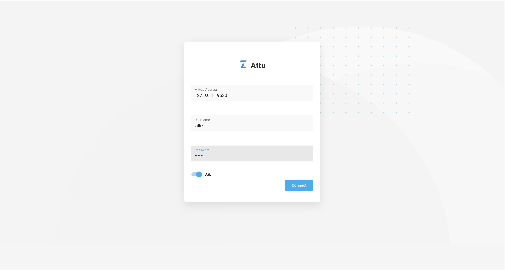

<div class="tab-wrapper"><a href="attu_install-docker.md" class='active '>Install with Docker Compose</a></div>

# Install Attu with Docker

Attu is an efficient open-source management tool for Milvus. This topic describes how to install Attu with Docker Compose, an efficient open-source management tool for Milvus.

## Prerequisites

- Milvus installed on [your local device](install_standalone-docker.md).
- Docker 19.03 or later
- Milvus 2.1.0 or later

<div class="alert note">
See <a href="https://milvus.io/docs/v2.0.x/attu_install-docker.md">v2.0.x Attu doc</a> if you are using Milvus 2.0.x.
</div>

## Milvus to Attu Version Mapping

| Milvus Version | Recommended Attu Image Version | 
| -------------- | ------------------------------ |
| v2.0.x         | v2.0.5                         |
| v2.1.x         | v2.1.5                         |
| v2.2.x         | v2.2.7           |

## Start an Attu instance

```Apache
docker run -p 8000:3000  -e MILVUS_URL={your machine IP}:19530 zilliz/attu:v2.2.7
```

Once you start the docker, visit `http://{ your machine IP }:8000` in your browser, and click **Connect** to enter the Attu service.
And we alsow support TLS connection, username and password.





# Install Milvus Standalone and Attu with Docker Compose

[Download](https://github.com/milvus-io/milvus/releases/download/v2.2.13/milvus-standalone-docker-compose.yml) `milvus-standalone-docker-compose.yml` and save it as `docker-compose.yml` manually, or with the following command.

```
$ wget https://github.com/milvus-io/milvus/releases/download/v2.2.13/milvus-standalone-docker-compose.yml -O docker-compose.yml
```

Edit the downloaded `docker-compose.yml` file using your favorite text editor and add the following to the services block:
```
  attu:
    container_name: attu
    image: zilliz/attu:v2.2.7
    environment:
      MILVUS_URL: milvus-standalone:19530
    ports:
      - "8000:3000"
    depends_on:
      - "standalone"
```
In the same directory as the `docker-compose.yml` file, start up Milvus and Attu by running:
```shell
$ sudo docker-compose up -d
```


<div class="alert note">
If your system has Docker Compose V2 installed instead of V1, use <code> docker compose </code> instead of <code> docker-compose </code>. Check if this is the case with <code> $ docker compose version </code>. Read <a href="https://docs.docker.com/compose/#compose-v2-and-the-new-docker-compose-command"> here </a> for more information.
</div>

```text
Creating milvus-etcd  ... done
Creating milvus-minio ... done
Creating milvus-standalone ... done
Creating attu ... done
```

Now check if the containers are up and running.

```
$ sudo docker-compose ps
```

After Milvus standalone starts, there will be three docker containers running, including the Milvus standalone service and its two dependencies.

```
      Name                     Command                  State                            Ports
--------------------------------------------------------------------------------------------------------------------
milvus-etcd         etcd -advertise-client-url ...   Up             2379/tcp, 2380/tcp
milvus-minio        /usr/bin/docker-entrypoint ...   Up (healthy)   9000/tcp
milvus-standalone   /tini -- milvus run standalone   Up             0.0.0.0:19530->19530/tcp, 0.0.0.0:9091->9091/tcp
attu                /usr/bin/docker-entrypoint ...   Up             0.0.0.0:8000->3000/tcp
```
Visit `http://{ your machine IP }:8000` in your browser, and click **Connect** to enter the Attu service.
And we alsow support TLS connection, username and password.


## Contribution

Attu is an open-source project. All contributions are welcome. Please read our [Contribute guide](https://github.com/zilliztech/attu) before making contributions.

If you find a bug or want to request a new feature, please create a [GitHub Issue](https://github.com/zilliztech/attu), and make sure that the same issue has not been created by someone else.
