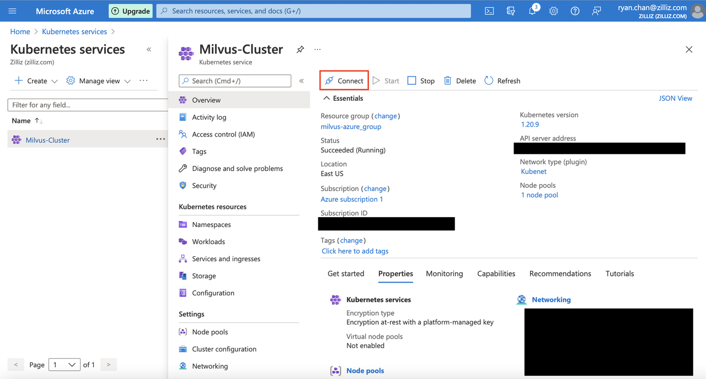

##  Deploy Milvus on Azure with AKS

 This topic describes how to provision and create a cluster with [Azure Kubernetes Service](https://azure.microsoft.com/en-us/services/kubernetes-service/#overview) (AKS) and the [Azure portal](https://portal.azure.com).

### Prerequisites

Ensure that your Azure project has been set up properly and you have access to the resources that you want to use. Contact your administrators if you are not sure about your access permission. 
   
### Software requirements
- [Azure CLI](https://docs.microsoft.com/en-us/cli/azure/install-azure-cli#install)
- [kubectl](https://kubernetes.io/docs/tasks/tools/)
- [Helm](https://helm.sh/docs/intro/install/)

Alternatively, you can use the [Cloud Shell](https://learn.microsoft.com/en-us/azure/cloud-shell/overview) which has the Azure CLI, kubectl, and Helm preinstalled.

<div class="alert note">After you install the Azure CLI, ensure that you are properly authenticated. </div>

### Provision a Kubernetes cluster

1. Log on to the Azure portal.
2. On the Azure portal menu or from the **Home** page, select **Create a resource**.
3. Select **Containers** > **Kubernetes Service**.
4. On the **Basics** page, configure the following options:

- **Project details**:
  - **Subscription**: Contact your organization's Azure Administrator to determine which subscription you should use.

    - **Resource group**: Contact your organization's Azure Administrator to determine which resource group you should use.

- **Cluster details**:
  - **Kubernetes cluster name**: Enter a cluster name.

  - **Region**: Select a region.

  - **Availability zones**: Select [availability zones](https://docs.microsoft.com/en-us/azure/aks/availability-zones#overview-of-availability-zones-for-aks-clusters) as you need. For production clusters, we recommend that you select multiple availability zones.

- **Primary node pool**:

  - **Node size**: We recommend that you choose VMs with a minimum of 16 GB of RAM, but you can select virtual machine sizes as you need.

  - **Scale method**: Choose a scale method.

  - **Node count range**: Select a range for the number of nodes.

- **Node pools**:

  - **Enable virtual nodes**: Select the checkbox to enable virtual nodes.

  - **Enable virtual machine scale sets**: We recommend that you choose `enabled`.

- **Networking**:

  - **Network configuration**: We recommend that you choose `Kubenet`.

  - **DNS name prefix**: Enter a DNS name prefix.

  - **Traffic Routing**:

    - **Load balancer**: `Standard`.

    - **HTTP application routing**: Not required.


5. After configuring the options, click **Review + create** and then **Create** when validation completes. It takes a few minutes to create the cluster. 

### Connect to the cluster

1. Navigate to the cluster that you have created in Kubernetes services and click it.
2. On the left-side navigation pane, click `Overview`.
3. On the **Overview** page that appears, click **Connect** to view the resource group and subscription.


### Set a subscription and credentials

<div class="alert note">You can use Azure Cloud Shell to perform the following procedures.</div>

1. Run the following command to set your subscription.

```shell
az account set --subscription EXAMPLE-SUBSCRIPTION-ID
```
2. Run the following command to download credentials and configure the Kubernetes CLI to use them.
   
```shell
az aks get-credentials --resource-group YOUR-RESOURCE-GROUP --name YOUR-CLUSTER-NAME
```

<div class="alert note">
Use the same shell for the following procedures. If you switch to another shell, run the preceding commands again.
</div>


### Using Azure Blob Storage as external object storage

Azure Blob Storage is Azure's version of AWS Simple Storage Service (S3).

- Create storage account and container
```bash
az storage account create -n milvustesting1 -g MyResourceGroup -l eastus --sku Standard_LRS --min-tls-version TLS1_2
az storage container create -n testmilvus --account-name milvustesting1
```

- get secret key, use the first value
```bash
az storage account keys list --account-name milvustesting2
```

- Add values.yaml
```yaml
cluster:
  enabled: true

service:
  type: LoadBalancer

extraConfigFiles:
  user.yaml: |+
    common:
      storageType: remote

minio:
  enabled: false

externalS3:
  enabled: true
  host: core.windows.net
  port: 443
  rootPath: my-release
  bucketName: testmilvus # the storage account container name
  cloudProvider: azure
  useSSL: true
  accessKey: "milvustesting1" # the storage account name
  secretKey: "<secret-key>" 
```

### Deploy Milvus

Now the Kubernetes cluster is ready. Let's deploy Milvus right now. 

```bash
helm repo add milvus https://zilliztech.github.io/milvus-helm/
helm repo update
helm install -f values.yaml my-release milvus/milvus
```

In the preceding commands, we add the repo of Milvus Helm charts locally and update the repo to fetch the latest charts. Then we install a Milvus instance and name it **my-release**. 

Notice the config `service.type` value, which indicates that we would like to expose the Milvus instance through a Layer-4 load balancer. 


### Verify the deployment

Once all pods are running, run the following command to view the external IP address and port used to access the Milvus instance.

```bash
kubectl get services
```

The result is similar to the following:


### Hello Milvus

Please refer to [Hello Milvus](https://milvus.io/docs/example_code.md), change the host value to service IP, then run the code.


## What's next

If you want to learn how to deploy Milvus on other clouds:
- [Deploy a Milvus Cluster on EC2](aws.md)
- [Deploy a Milvus Cluster on EKS](eks.md)
- [Deploy a Milvus Cluster on GCP](gcp.md)
