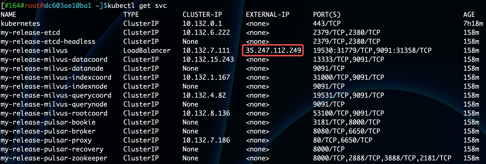

## Deploy a Milvus Cluster on GCP

Milvus is a cloud-native vector database and can be deployed on various cloud environments. This guide walks you through every detail about setting up Milvus on Google Cloud Platform (GCP).


### Before you start

To deploy Milvus on GCP, ensure that

- A project already exists in your GCP account. 

  To create a project, refer to [Creating and managing projects](https://cloud.google.com/resource-manager/docs/creating-managing-projects). The name of the project used in this guide is **milvus-testing-nonprod**. 

- You have locally installed [gcloud CLI](https://cloud.google.com/sdk/docs/quickstart#installing_the_latest_version), [kubectl](https://kubernetes.io/docs/tasks/tools/), and [Helm](https://helm.sh/docs/intro/install/), or decided to use the browser-based [Cloud Shell](https://cloud.google.com/shell) instead.

- You have [initialized the gcloud CLI](https://cloud.google.com/sdk/docs/install-sdk#initializing_the) with your GCP account credentials.

### Set up the network

To ensure Milvus security, you need to create a logically isolated virtual network in your GCP project. The following command creates a VPC.

```bash
gcloud compute networks create milvus-network \
    --project=milvus-testing-nonprod \
    --subnet-mode=auto \
    --mtu=1460 \
    --bgp-routing-mode=regional
```

To facilitate your work, you also need to set up several firewall rules to allow external traffic over ICMP, RDP, and SSH as well as the traffic within the VPC.

```bash
gcloud compute firewall-rules create milvus-network-allow-icmp \
    --project=milvus-testing-nonprod \
    --network=projects/milvus-testing-nonprod/global/networks/milvus-network \
    --description="Allows ICMP connections from any source to any instance on the network." \
    --direction=INGRESS \
    --priority=65534 \
    --source-ranges=0.0.0.0/0 \
    --action=ALLOW \
    --rules=icmp

gcloud compute firewall-rules create milvus-network-allow-internal \
    --project=milvus-testing-nonprod \
    --network=projects/milvus-testing-nonprod/global/networks/milvus-network \
    --description="Allows connections from any source in the network IP range to any instance on the network using all protocols." \
    --direction=INGRESS \
    --priority=65534 \
    --source-ranges=10.128.0.0/9 \
    --action=ALLOW --rules=all

gcloud compute firewall-rules create milvus-network-allow-rdp \
    --project=milvus-testing-nonprod \
    --network=projects/milvus-testing-nonprod/global/networks/milvus-network \
    --description="Allows RDP connections from any source to any instance on the network using port 3389." \ --direction=INGRESS \
    --priority=65534 \
    --source-ranges=0.0.0.0/0 \
    --action=ALLOW \
    --rules=tcp:3389

gcloud compute firewall-rules create milvus-network-allow-ssh \
    --project=milvus-testing-nonprod \
    --network=projects/milvus-testing-nonprod/global/networks/milvus-network \
    --description="Allows TCP connections from any source to any instance on the network using port 22." \ --direction=INGRESS \
    --priority=65534 \
    --source-ranges=0.0.0.0/0 \
    --action=ALLOW \
    --rules=tcp:22
```

Finally, you need to allow the incoming traffic to the Milvus instance we will create later at port **19530**.

```bash
gcloud compute firewall-rules create allow-milvus-in \
    --project=milvus-testing-nonprod  \
    --description="Allow ingress traffic for Milvus on port 19530" \
    --direction=INGRESS \
    --priority=1000 \
    --network=projects/milvus-testing-nonprod/global/networks/milvus-network \
    --action=ALLOW \
    --rules=tcp:19530 \
    --source-ranges=0.0.0.0/0
```

### Provision a Kubernetes cluster

In this guide, we will use the Google Kubernetes Engine (GKE) service to provision a Kubernetes cluster with two nodes in the **us-west1-a** zone. Each node is an **e2-standard-4** Compute Engine virtual machine running the **COS_CONTAINERD** image.

<div class="alert note">

You are advised to use the types of machines that offer a minimum memory of 16 GB to ensure service stability.

</div>

```bash
gcloud container clusters create "milvus-cluster-1" \
    --project "milvus-testing-nonprod" \
    --zone "us-west1-a" \
    --no-enable-basic-auth \
    --cluster-version "1.27.3-gke.100" \
    --release-channel "regular" \
    --machine-type "c2-standard-4" \
    --image-type "COS_CONTAINERD" \
    --disk-type "pd-standard" \
    --disk-size "100" \
    --max-pods-per-node "110" \
    --num-nodes "3" \
    --enable-ip-alias \
    --network "projects/milvus-testing-nonprod/global/networks/milvus-network" \
    --subnetwork "projects/milvus-testing-nonprod/regions/us-west1/subnetworks/milvus-network"
```

It would take a couple of minutes for the Kubernetes cluster to go up. Once the cluster is ready, use the following command to fetch its credentials so that you can run `kubectl` commands in your terminal to communicate with the cluster remotely.

```bash
gcloud container clusters get-credentials milvus-cluster-1 --zone "us-west1-a"
```

### Deploy Milvus

Now the Kubernetes cluster is ready. Let's deploy Milvus right now. 

```bash
helm repo add milvus https://zilliztech.github.io/milvus-helm/
helm repo update
helm install my-release milvus/milvus --set service.type=LoadBalancer
```

In the preceding commands, we add the repo of Milvus Helm charts locally and update the repo to fetch the latest charts. Then we install a Milvus instance and name it **my-release**. 

Notice the arguments following the `--set` flag, which indicates that we would like to expose the Milvus instance through a Layer-4 load balancer. 

If you would like to expose your Milvus instance through a Layer-7 load balancer, [read this](gcp_layer7.md).

### Verify the deployment

Once all pods are running, run the following command to view the external IP address and port used to access the Milvus instance.

```bash
kubectl get services
```

The result is similar to the following:



### Use Google Cloud Storage (GCS) as external object storage

- Create bucket.
```bash
gcloud storage buckets create gs://milvus-testing-nonprod --project=milvus-testing-nonprod --default-storage-class=STANDARD --location=us-west1 --uniform-bucket-level-access
```
- Generate User Access Key and Secret Key, you should go to your project’s storage page. In the left sidebar of the dashboard, click Google Cloud Storage and then Settings. Select the INTEROPERABILITY tab. If you haven't enabled it already, click on Interoperable Access. Then click CREATE A KEY button to create.

- Add values.yaml
```yaml
cluster:
    enabled: true

service:
    type: LoadBalancer

minio:
    enabled: false

externalS3:
    enabled: true
    host: storage.googleapis.com
    port: 443
    rootPath: milvus/my-release
    bucketName: milvus-testing-nonprod
    cloudProvider: gcp
    useSSL: true
    accessKey: "<access-key>"
    secretKey: "<secret-key>"
```

- Install milvus
```bash
helm install -f values.yaml my-release milvus/milvus
```
