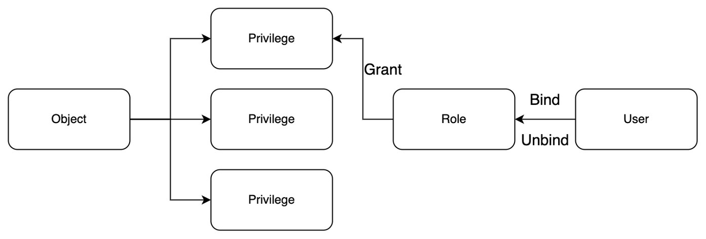

# Users and Roles

This topic explains the definition of users, roles, objects, and privileges in role-based access control (RBAC).

- **Object:** An object to grant or deny access to. The object can be a collection, a partition, etc. 

- **User:** A user identity with a username and a corresponding password.

- **Privilege:** A privilege defines the actions that can be performed and resources that can be accessed. A privilege cannot be granted to a user directly. It has to be granted to a role first.

- **Role:** A role defines the privilege(s) a user has to certain objects. After binding a role to a user, the user inherits all the privileges that are granted to this role.

The following figure illustrates the relationship between objects, privileges, roles, and users.

The relationship between object, privilege, role and user.

Milvus creates a `root` user by default with a default password `Milvus`. The `root` user is granted the `admin` privileges, which means that this `root` user can have access to all resources and perform all actions.

If a user is bind with a `public` role, this user is entitled to the privileges of `DescribeCollection`, `ShowCollections`, and `IndexDetail`.

The following table lists the values you can choose when [enabling RBAC](rbac.md).

| Object name | Privilege name        | Relevant API description on the client side       |
| ----------- | --------------------- | ------------------------------------------------- |
| Collection  | CreateIndex           | CreateIndex                                       |
| Collection  | DropIndex             | DropIndex                                         |
| Collection  | IndexDetail           | DescribeIndex/GetIndexState/GetIndexBuildProgress |
| Collection  | Load                  | LoadCollection                                    |
| Collection  | GetLoadingProgress    | GetLoadingProgress                                |
| Collection  | Release               | ReleaseCollection                                 |
| Collection  | Insert                | Insert                                            |
| Collection  | Delete                | Delete                                            |
| Collection  | Search                | Search                                            |
| Collection  | Flush                 | Flush                                             |
| Collection  | Query                 | Query                                             |
| Collection  | GetStatistics         | GetCollectionStatistics                           |
| Collection  | Compaction            | Compact                                           |
| Collection  | Alias                 | CreateAlias/DropAlias/AlterAlias                  |
| Collection  | Import                | BulkInsert/Import                                 |
| Collection  | LoadBalance           | LoadBalance                                       |
| Global      | All                   | All API operation permissions in this table       |
| Global      | CreateCollection      | CreateCollection                                  |
| Global      | DropCollection        | DropCollection                                    |
| Global      | DescribeCollection    | DescribeCollection                                |
| Global      | ShowCollections       | ShowCollections                                   |
| Global      | CreateOwnership       | CreateUser CreateRole                             |
| Global      | DropOwnership         | DeleteCredential DropRole                         |
| Global      | SelectOwnership       | SelectRole/SelectGrant                            |
| Global      | ManageOwnership       | OperateUserRole OperatePrivilege                  |
| Global      | CreateResourceGroup   | CreateResourceGroup                               |
| Global      | DropResourceGroup     | DropResourceGroup                                 |
| Global      | DescribeResourceGroup | DescribeResourceGroup                             |
| Global      | ListResourceGroups    | ListResourceGroups                                |
| Global      | TransferNode          | TransferNode                                      |
| Global      | TransferReplica       | TransferReplica                                   |
| Global      | RenameCollection      | RenameCollection                                  |
| Global      | CreateDatabase        | CreateDatabase                                    |
| Global      | ListDatabases         | ListDatabases                                     |
| User        | UpdateUser            | UpdateCredential                                  |
| User        | SelectUser            | SelectUser                                        |

<li>Object and privilege names are case-sensitive.</li>
<li>To grant all privileges to a kind of object, like Collection, Global, User, use "*" for privilege name. </li>
<li>The "*" privilege name for the Global object doesn't include the All privilege, because the All privilege includes all permissions, including any collection and user object.</li>

## What's next
- Learn how to [enable RBAC](rbac.md).
